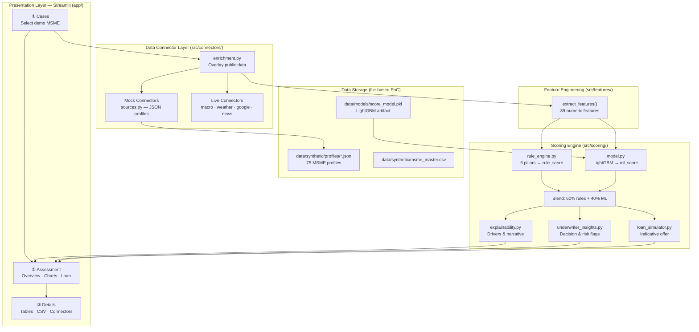
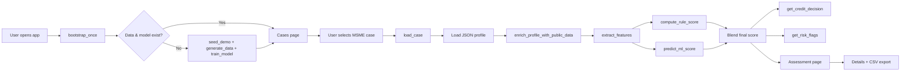
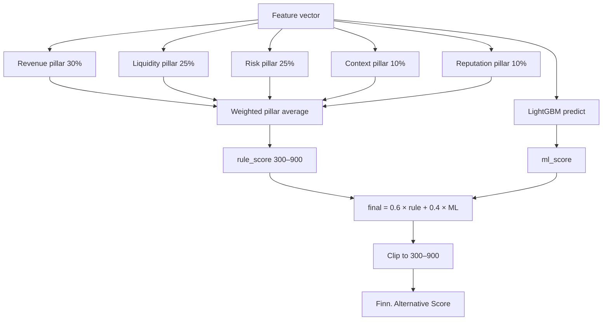
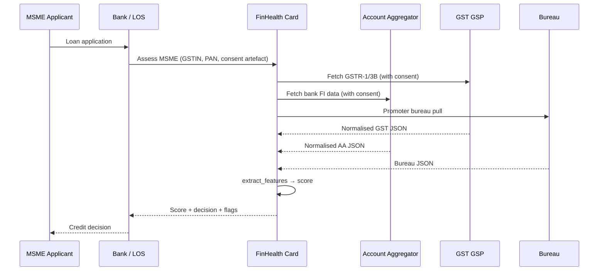
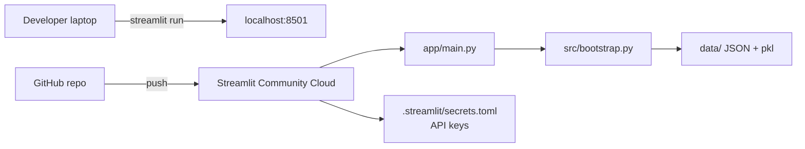
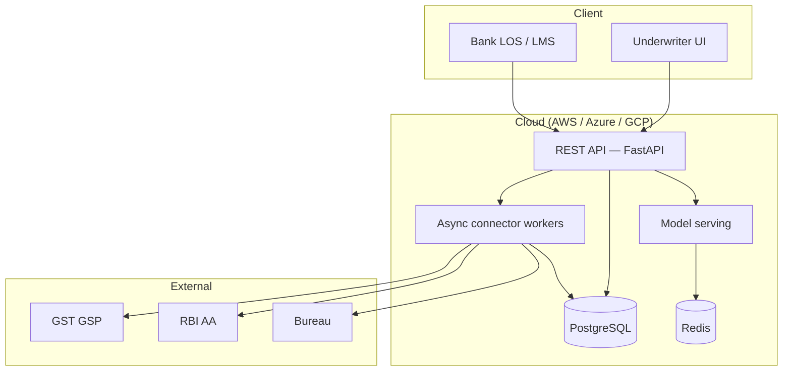

# FinHealth Card — Solution Document

**Product:** Finn. Alternative Score System (FinHealth Card)  
**Audience:** IDBI stakeholders, underwriters, technical reviewers, hackathon judges  
**Version:** PoC / Prototype (July 2026)  
**Repository:** [github.com/arunbhatg/finhealth-card](https://github.com/arunbhatg/finhealth-card)

---

## 1. Solution Summary (200–300 words)

**FinHealth Card** is an alternative-data credit assessment platform built for **New-To-Credit (NTC) MSMEs** — small businesses that lack audited financial statements and commercial bureau history, yet generate rich digital footprints through GST filings, UPI collections, payroll, and banking behaviour.

Traditional underwriting rejects these applicants by default. FinHealth Card closes the gap by aggregating **10 behavioural data sources** into a unified financial health view, engineering **39 quantitative features**, and producing a **Finn. Alternative Score** on a familiar **300–900 scale** (CIBIL-like). The score is computed through a **hybrid engine**: an explainable **five-pillar rule model** (60% weight) blended with a **LightGBM regressor** (40% weight) for calibration.

The system delivers an underwriter-ready outcome in minutes: **APPROVE / REVIEW / DECLINE** recommendation, pillar-level breakdown, red/amber/green risk flags, top score drivers, trend charts across GST/UPI/bank/EPFO data, and an **indicative loan offer** (limit, rate, tenure). The architecture uses a **connector pattern** so mock PoC data can be swapped for live GSTN, Account Aggregator, bureau, and EPFO APIs without changing the scoring pipeline.

**Important PoC disclaimer:** All borrower-specific records (GST, UPI, AA, EPFO, bureau, courts, electricity, investment) are **synthetic dummy data** generated by Faker and stored as JSON profiles. Only **macro/RBI**, **weather/rainfall**, and optionally **Google Places** use live public APIs today. Scoring logic, feature formulas, and UI workflows are production-shaped; data connectors are the primary gap to production.

The prototype is delivered as a **Streamlit web application** with a three-step underwriter flow: **Cases → Assessment → Details**, demonstrating four curated demo personas that show how the same NTC applicant receives APPROVE vs DECLINE outcomes based on digital footprint quality.

---

## 2. Problem Statement Mapping

### 2.1 The Core Problem

| Traditional lender requirement | NTC MSME reality | Consequence |
|-------------------------------|------------------|-------------|
| 2–3 years audited P&L | Informal books, no CA-certified statements | No financials to score |
| Commercial CIBIL / bureau rank | No prior borrowings → no commercial score | Automatic decline |
| Collateral documentation | Asset-light, rented premises | Cannot meet secured-product norms |
| Bank statement analysis | Multiple informal accounts | Incomplete cash-flow picture |

**Result:** Viable businesses with healthy GST compliance, UPI collections, and payroll are **declined** despite strong behavioural signals.

### 2.2 How FinHealth Card Maps to Each Gap

| Problem | FinHealth Card response | Data source(s) |
|---------|------------------------|----------------|
| No audited revenue | GST turnover trend, filing compliance, B2B ratio | GST Returns |
| No commercial bureau | Promoter consumer CIBIL + alt-data mosaic | Bureau + all alt sources |
| No formal collections proof | UPI merchant volume, P2M ratio, failure rate | UPI Merchant |
| No liquidity view | ABB, EMI discipline, cashflow surplus, bounces | Account Aggregator |
| No employment validation | EPFO headcount, wage bill, attrition | EPFO |
| No reputation signal | Google rating + NLP sentiment on reviews | Google Business |
| Governance blind spots | Civil/criminal cases, insolvency petitions | Court Records |
| Production proxy missing | Electricity kWh trend, payment regularity | Electricity Discom |
| Sector context ignored | Sector growth %, monsoon index, govt schemes | Macro + Weather |
| Investment/R&D invisible | Capex, R&D spend, patents | MCA / Investment |

### 2.3 Demonstrated Outcomes (Demo Personas)

| Case ID | Business | Traditional outcome | Alt-data outcome | Key insight |
|---------|----------|--------------------|--------------------|-------------|
| **MSME001** | Sharma Precision Works (Manufacturing, Pune) | Reject — no file | ~740 · **APPROVE** | GST + EPFO + promoter CIBIL align |
| **MSME002** | Patel Kirana & General Store (Retail, Ahmedabad) | Reject | ~718 · **APPROVE** | UPI velocity proves daily revenue |
| **MSME003** | Gupta Trading Company (Retail, Delhi) | Reject | ~462 · **DECLINE** | GST delays + litigation visible early |
| **MSME004** | Krishi Mitra Agro Supplies (Agri-Input, Nagpur) | Review | ~705 · **APPROVE** | Sector/monsoons adjust context |

### 2.4 Why This Builds a Better New-To-Credit Score

1. **Uses data NTC MSMEs already create** — tax filings, digital payments, payroll, and bank transactions — instead of documents they cannot produce.
2. **Cross-validates signals** — GST turnover vs UPI volume vs bank credits detects inconsistencies and fraud (e.g., declared production vs electricity consumption).
3. **Supplements thin commercial file with promoter bureau** — consumer CIBIL of the promoter provides character overlay when business bureau is absent.
4. **Sector- and geography-aware** — monsoon index and sector growth adjust context for agri-input and cyclical businesses.
5. **Explainable by design** — five pillars with driver-level breakdown satisfy RBI fair-practices and underwriter audit needs; ML calibrates but does not black-box the decision.
6. **Near real-time** — consent + data fetch + score in minutes vs days/weeks for document-based underwriting.
7. **Actionable feedback** — risk flags (GST irregular, bounces, litigation) tell the borrower what to improve for re-application.

---

## 3. Complete Feature List

### 3.1 Scoring Features (39 numeric features)

Defined in `src/features/feature_engineering.py` as `FEATURE_COLUMNS`:

| # | Feature | Source | Description / Formula |
|---|---------|--------|----------------------|
| 1 | `years_in_business` | Profile | Tenure of MSME operation |
| 2 | `gst_filing_compliance` | GST | % of periods with status = "filed" |
| 3 | `gst_turnover_yoy_growth` | GST | Year-over-year growth of monthly turnover |
| 4 | `gst_avg_monthly_turnover` | GST | Average of last 6 months turnover (lakhs) |
| 5 | `gst_payment_delays` | GST | Count of delayed GST payments |
| 6 | `gst_b2b_ratio` | GST | B2B sales as fraction of total |
| 7 | `upi_volume_yoy_growth` | UPI | YoY growth of merchant UPI volume |
| 8 | `upi_avg_monthly_volume` | UPI | Average last 6 months UPI volume (lakhs) |
| 9 | `upi_p2m_ratio` | UPI | Person-to-merchant transaction ratio |
| 10 | `upi_failed_txn_rate` | UPI | Failed transaction rate |
| 11 | `aa_abb_lakhs` | Account Aggregator | Average bank balance (lakhs) |
| 12 | `aa_emi_on_time_rate` | AA | EMI/bill payment on-time rate |
| 13 | `aa_bounce_count` | AA | Cheque/autopay bounces in 12 months |
| 14 | `aa_od_utilization` | AA | Overdraft utilization ratio |
| 15 | `aa_cashflow_surplus_ratio` | AA | (Credits − Debits) / Credits over last 6 months |
| 16 | `aa_balance_trend` | AA | YoY trend of monthly closing balance |
| 17 | `epfo_headcount` | EPFO | Latest employee count |
| 18 | `epfo_headcount_growth` | EPFO | YoY headcount growth |
| 19 | `epfo_contribution_compliance` | EPFO | % of months with contribution status = "paid" |
| 20 | `epfo_wage_bill_trend` | EPFO | YoY trend of monthly wage bill |
| 21 | `epfo_attrition_rate` | EPFO | Employee attrition rate |
| 22 | `google_rating` | Google | Average star rating |
| 23 | `google_sentiment_score` | Google | NLP sentiment (0–1) on review text |
| 24 | `google_review_velocity_6m` | Google | New reviews in last 6 months |
| 25 | `google_response_rate` | Google | Owner response rate to reviews |
| 26 | `promoter_cibil` | Bureau | Promoter consumer CIBIL score |
| 27 | `promoter_dpd_12m` | Bureau | Days past due in last 12 months |
| 28 | `promoter_write_offs` | Bureau | Write-offs in last 36 months |
| 29 | `promoter_credit_utilization` | Bureau | Credit utilisation ratio |
| 30 | `court_civil_cases` | Courts | Active civil cases |
| 31 | `court_criminal_cases` | Courts | Active criminal cases |
| 32 | `court_insolvency` | Courts | Insolvency petitions |
| 33 | `court_litigation_amount` | Courts | Outstanding litigation (lakhs) |
| 34 | `electricity_kwh_yoy` | Electricity | YoY kWh consumption trend |
| 35 | `electricity_avg_kwh` | Electricity | Average last 6 months kWh |
| 36 | `electricity_payment_regularity` | Electricity | On-time bill payment rate |
| 37 | `sector_growth_pct` | Macro | Sector growth from static table |
| 38 | `monsoon_index_pct` | Macro/Weather | Rainfall index (80–130% scale) |
| 39 | `rnd_spend` | Investment | Annual R&D spend (lakhs) |
| 40 | `capex_12m` | Investment | Capex in last 12 months (lakhs) |
| 41 | `patents_count` | Investment | Patent count |
| 42 | `govt_scheme` | Investment | Govt scheme beneficiary (0/1) |

> **Note:** `msme_id` and `sector` are extracted for display but not in `FEATURE_COLUMNS` used for ML.

### 3.2 Five Scoring Pillars

| Pillar | Weight | Signals used |
|--------|--------|--------------|
| **Revenue** | 30% | GST turnover growth, filing compliance, UPI volume growth, electricity kWh trend |
| **Liquidity** | 25% | ABB, EMI on-time rate, cashflow surplus, EPFO compliance; penalties for bounces/GST delays |
| **Risk** | 25% | Promoter CIBIL, credit utilisation, DPD; litigation penalties |
| **Context** | 10% | Sector growth, monsoon index, govt scheme beneficiary |
| **Reputation** | 10% | Google rating, NLP sentiment, review velocity, response rate |

### 3.3 Credit Decision Thresholds

| Score range | Decision | Meaning |
|-------------|----------|---------|
| ≥ 700 | **APPROVE** | Eligible for unsecured MSME working-capital limit |
| 550–699 | **REVIEW** | Approve with conditions or reduced limit |
| < 550 | **DECLINE** | Not recommended for unsecured credit |

### 3.4 Risk Flags (Underwriter Alerts)

Generated from features + profile in `underwriter_insights.py`:

- **Red:** GST filing irregular, autopay/cheque failures, utility bill delays, active litigation, insolvency, high promoter DPD, negative news signals
- **Amber:** GST late penalties (≤2), weak bill-pay discipline, mixed sentiment
- **Green:** Bills paid on time, strong GST compliance, positive review sentiment

### 3.5 Application Features (UI / Workflow)

| Feature | Description |
|---------|-------------|
| Case selection | 4 curated demo MSME personas with score preview |
| Finn. Alternative Score gauge | 300–900 visual gauge with grade (Excellent/Good/Fair/Poor) |
| Credit decision banner | APPROVE / REVIEW / DECLINE with rationale |
| 10 KPI metrics | Turnover, bill on-time %, ABB, headcount, etc. |
| Score drivers | Top boosters and draggers with point impact |
| Trend charts | GST, UPI, bank cashflow, EPFO, electricity, sector growth, sentiment, news |
| Loan simulator | Slider for requested amount → approved limit, rate, tenure |
| Data summary sheet | Raw source values in tables |
| CSV export | Download assessment data |
| Connector status panel | Live vs mock badge per data source |
| Sidebar case context | Active case name, sector, score; change case |

---

## 4. Feature Engineering — Detailed Explanation

Feature engineering is the bridge between raw alternative data and the scoring engine. All logic lives in `src/features/feature_engineering.py`.

### 4.1 Pipeline Overview

```
MSME Profile JSON
  ├── gst, upi, aa, epfo, google, bureau, courts, electricity, macro, investment
  │
  ▼
extract_features(profile)  →  39-feature dict
  │
  ├── Used by rule_engine.py  →  5 pillar scores  →  rule_score (300–900)
  └── Used by model.py        →  LightGBM predict  →  ml_score
```

### 4.2 Input Schema (per source)

Each connector returns a nested JSON object. Example structure for GST:

```json
{
  "monthly_turnover_lakhs": [12.5, 13.1, 14.0, ...],
  "filing_status": ["filed", "filed", "delayed", ...],
  "b2b_sales_ratio": 0.72,
  "payment_delays_count": 0
}
```

**Design rule:** Live API connectors must map responses to this same schema. Feature engineering never changes when going to production.

### 4.3 Transformation Functions

| Helper | Location | Purpose |
|--------|----------|---------|
| `yoy_growth(series)` | `src/utils/helpers.py` | Year-over-year % change on time series |
| `avg_recent(series, n)` | helpers | Mean of last *n* periods |
| `compliance_rate(statuses, good_set)` | helpers | Fraction of periods in compliant state |
| `_google_sentiment(reviews)` | feature_engineering | Weighted sentiment: positive=1.0, neutral=0.5, negative=0.0 |

### 4.4 Key Derived Features (examples)

**Cashflow surplus ratio (AA):**
```
surplus[i] = credits[i] - debits[i]
aa_cashflow_surplus_ratio = sum(surplus[-6:]) / max(1, sum(credits[-6:]))
```

**GST filing compliance:**
```
gst_filing_compliance = count(filing_status == "filed") / total_periods
```

**Sector growth:** Looked up from `SECTOR_GROWTH` table in `constants.py` (Manufacturing 6.2%, Retail 8.5%, Agri-Input 4.8%, etc.)

**Monsoon index:** In PoC, either synthetic default (100%) or live overlay from Open-Meteo 30-day precipitation mapped to 80–130% scale.

### 4.5 Training Matrix

`build_feature_matrix()` iterates all `data/synthetic/profiles/*.json` (75 profiles) and builds a Pandas DataFrame for ML training. Labels are rule-derived scores with Gaussian noise (σ=15) to simulate real-world variance.

---

## 5. System Architecture Diagram



### 5.1 Layer Responsibilities

| Layer | Technology | Responsibility |
|-------|------------|----------------|
| Presentation | Streamlit | Underwriter UI, session state, navigation |
| Connectors | Python classes | Fetch/normalise data per source; mock or live |
| Feature engineering | Pandas/NumPy | Transform raw data → feature vector |
| Scoring | LightGBM + rules | Score, explain, decide, simulate loan |
| Storage | JSON + pickle | Profiles and trained model (no DB in PoC) |

---

## 6. Process Flow Diagram

### 6.1 End-to-End Assessment Flow



### 6.2 Scoring Sub-Flow



### 6.3 Production Consent Flow (future)



---

## 7. UI Screenshots / Wireframes

> **Note:** No screenshot assets are committed to the repository. Run `streamlit run app/main.py` locally to capture prototype screenshots. Below are wireframe descriptions matching the live UI.

### 7.1 Screen ① — Cases (Entry)

```
┌─────────────────────────────────────────────────────────────────────┐
│  Finn. Alternative Score System                                      │
│  NTC MSME underwriting · powered by Finndot alternative data         │
├─────────────────────────────────────────────────────────────────────┤
│  ( Cases )    Assessment    Details                                  │
├─────────────────────────────────────────────────────────────────────┤
│  Select a case                                                       │
│  Choose a demo MSME profile to generate a Finn. alternative score.   │
│                                                                      │
│  ┌─────────────────────────┐  ┌─────────────────────────┐            │
│  │ Sharma Precision Works  │  │ Patel Kirana & General  │            │
│  │ Manufacturing · Pune    │  │ Retail · Ahmedabad      │            │
│  │ Score: 740  Turnover: … │  │ Score: 718  Turnover: … │            │
│  │ APPROVE                 │  │ APPROVE                 │            │
│  │ [ Open case ]           │  │ [ Open case ]           │            │
│  └─────────────────────────┘  └─────────────────────────┘            │
│  ┌─────────────────────────┐  ┌─────────────────────────┐            │
│  │ Gupta Trading Company   │  │ Krishi Mitra Agro       │            │
│  │ DECLINE · Score ~462    │  │ APPROVE · Score ~705    │            │
│  └─────────────────────────┘  └─────────────────────────┘            │
└─────────────────────────────────────────────────────────────────────┘
```

### 7.2 Screen ② — Assessment (Overview tab)

```
┌─────────────────────────────────────────────────────────────────────┐
│  Cases    ( Assessment )    Details                                  │
├─────────────────────────────────────────────────────────────────────┤
│  [ Overview ]  [ Charts ]  [ Loan ]                                   │
│                                                                      │
│  ┌──────────┐  APPROVE — Eligible for unsecured MSME working capital  │
│  │  GAUGE   │  Strong alt-data footprint across revenue, liquidity…  │
│  │   742    │                                                        │
│  │ Finn.    │  ┌─────┬─────┬─────┬─────┬─────┐                      │
│  │  Score   │  │ KPI │ KPI │ KPI │ KPI │ ... │  (10 metrics)        │
│  └──────────┘  └─────┴─────┴─────┴─────┴─────┘                      │
│                                                                      │
│  Concerns: [GST ✓] [Bounces ✓] [Litigation ✗]                       │
│  Strengths: [UPI growth] [EPFO stable]                                │
│                                                                      │
│  Top boosters: +GST turnover growth  +EMI on-time  +Google sentiment  │
│  Top draggers:  (if any)                                              │
│                                                                      │
│  Pillar breakdown: Revenue 78 · Liquidity 72 · Risk 81 · …           │
└─────────────────────────────────────────────────────────────────────┘
```

### 7.3 Screen ② — Assessment (Charts tab)

Trend line charts (Plotly):
- GST monthly turnover
- UPI merchant volume
- Bank credits vs debits (cashflow)
- EPFO headcount
- Google review sentiment distribution
- Sector vs business growth comparison
- Electricity kWh consumption
- Business news feed (positive/negative signals)

### 7.4 Screen ② — Assessment (Loan tab)

- Slider: requested loan amount (lakhs)
- Output: approved amount, max eligible, interest rate %, tenure months, eligibility yes/no

### 7.5 Screen ③ — Details

- Tabular raw data per source (GST, UPI, AA, EPFO, etc.)
- Connector status badges: 🟢 LIVE / ⚪ MOCK per source
- **Download CSV** button for full assessment export

### 7.6 Sidebar (all screens)

- Finn. branding + Finndot Play Store link
- Active case name, sector, score
- **Change case** button

---

## 8. Technology Stack

| Category | Technology | Version / Notes |
|----------|------------|-----------------|
| Language | Python | 3.12 |
| Web framework | Streamlit | ≥ 1.32 |
| Data processing | Pandas, NumPy | ≥ 2.1 / ≥ 1.26 |
| Machine learning | LightGBM, scikit-learn | ≥ 4.3 / ≥ 1.4 |
| Model persistence | joblib | ≥ 1.3 |
| Visualization | Plotly | ≥ 5.18 |
| Synthetic data | Faker | ≥ 24.0 |
| HTTP (live APIs) | requests | ≥ 2.31 |
| Validation | Pydantic | ≥ 2.6 (dependency) |
| Deployment | Streamlit Community Cloud | `app/main.py` entry |
| Version control | Git / GitHub | — |

**Not used in PoC:** REST API server, relational database, Redis, message queue, container orchestration.

---

## 9. AI/ML Models Used

### 9.1 LightGBM Regressor (Primary ML Model)

| Attribute | Value |
|-----------|-------|
| Algorithm | `LGBMRegressor` (gradient boosted trees) |
| Hyperparameters | 120 estimators, learning rate 0.08, max depth 5 |
| Input | 39-feature vector (`FEATURE_COLUMNS`) |
| Output | Continuous score (300–900) |
| Training data | 75 synthetic MSME profiles |
| Labels | Rule-derived scores + Gaussian noise (σ=15) |
| Train/test split | 80/20, random_state=42 |
| Artifact | `data/models/score_model.pkl` |
| Training script | `scripts/train_model.py` |

### 9.2 Rule-Based Pillar Engine (Explainability Layer)

| Attribute | Value |
|-----------|-------|
| Type | Weighted multi-signal scoring (not ML) |
| Pillars | 5 (Revenue, Liquidity, Risk, Context, Reputation) |
| Scaling | Linear `_scale(value, lo, hi)` → 0–100 per signal |
| Penalties | Bounces, GST delays, litigation cases |
| Output | `rule_score` on 300–900 scale |
| Module | `src/scoring/rule_engine.py` |

### 9.3 Hybrid Blend

```
final_score = 0.6 × rule_score + 0.4 × ml_score
final_score = clip(final_score, 300, 900)
```

If ML model is not trained, falls back to rule-only score.

### 9.4 NLP Sentiment (Lightweight)

| Attribute | Value |
|-----------|-------|
| Method | Rule-based weighted sentiment on review text |
| Weights | positive=1.0, neutral=0.5, negative=0.0 |
| Feature | `google_sentiment_score` |
| Note | Reviews are synthetic in PoC; NLP logic is real |

### 9.5 Explainability Components

| Component | Module | Output |
|-----------|--------|--------|
| Score drivers | `explainability.py` | Top boosters/draggers with point impact |
| Narrative | `explainability.py` | Human-readable score summary |
| Risk flags | `underwriter_insights.py` | Red/amber/green underwriting alerts |
| Pillar breakdown | `rule_engine.py` | Per-pillar score + signal drivers |

---

## 10. APIs and Third-Party Integrations

### 10.1 Truthful Status: Live vs Dummy

| # | Source | PoC status | API / integration | Dummy data? |
|---|--------|------------|-------------------|-------------|
| 1 | **Macro / RBI** | 🟢 **LIVE** | [Indian Data Project](https://indiandataproject.org/open-data) + GitHub fallback | No — live public data |
| 2 | **Weather / Rainfall** | 🟢 **LIVE** | [Open-Meteo](https://open-meteo.com/) (no API key) | No — live; fallback to synthetic if API fails |
| 3 | **Google Business** | 🟡 **Optional LIVE** | Google Places API (API key required) | **Yes by default** — synthetic reviews unless `GOOGLE_PLACES_API_KEY` set |
| 4 | **Sector growth** | 🟡 **STATIC** | Hardcoded `SECTOR_GROWTH` table | Static representative values, not live API |
| 5 | **GST Returns** | ⚪ **MOCK** | GSP / GST Suvidha Provider (production) | **Yes — dummy JSON** in `data/synthetic/profiles/` |
| 6 | **UPI Merchant** | ⚪ **MOCK** | Bank / NPCI merchant API (production) | **Yes — dummy JSON** |
| 7 | **Account Aggregator** | ⚪ **MOCK** | RBI AA framework — FIU + Sahamati (production) | **Yes — dummy JSON** |
| 8 | **EPFO** | ⚪ **MOCK** | EPFO employer API / API Setu (production) | **Yes — dummy JSON** |
| 9 | **Promoter Bureau** | ⚪ **MOCK** | CIBIL / CRIF / Experian (production) | **Yes — dummy JSON** |
| 10 | **Court Records** | ⚪ **MOCK** | eCourts / legal aggregators (production) | **Yes — dummy JSON** |
| 11 | **Electricity** | ⚪ **MOCK** | Discom API / bill OCR (production) | **Yes — dummy JSON** |
| 12 | **Investment / MCA** | ⚪ **MOCK** | MCA21 / patent registry (production) | **Yes — dummy JSON** |
| 13 | **Business News** | ⚪ **MOCK** | NewsAPI.org skeleton (`USE_LIVE_NEWS = False`) | **Yes — mock headlines** aligned to persona |

**Summary:** 2 connectors are live without API key (Macro, Weather). 1 is live with API key (Google). **All 7 borrower-specific regulated sources use synthetic dummy data** in this PoC.

### 10.2 Live API Details

#### Macro / RBI (`src/connectors/live/macro_public.py`)
- **Primary URL:** `https://indiandataproject.org/data/rbi/2025-26/summary.json`
- **Fallback:** `oriz-rbi-rates-api` GitHub raw JSON
- **Fields:** repo rate, CPI, RBI policy stance

#### Weather (`src/connectors/live/weather_public.py`)
- **API:** Open-Meteo forecast (free, no key)
- **Input:** MSME city → lat/lon lookup (10 Indian cities)
- **Output:** 30-day precipitation → `monsoon_index_pct`

#### Google Places (`src/connectors/live/google_places.py`)
- **API:** Google Places Text Search + Place Details
- **Env vars:** `GOOGLE_PLACES_API_KEY` or `STREAMLIT_GOOGLE_PLACES_API_KEY`
- **Without key:** Falls back to synthetic review data in profile JSON

### 10.3 Production API Targets (not yet integrated)

| Source | Production provider | Consent required |
|--------|--------------------|--------------------|
| GST | GST Suvidha Provider (Clear, IRIS, etc.) | GSTIN + OTP |
| UPI | Acquiring bank / PSP | Merchant agreement |
| AA | RBI-licensed FIU via Sahamati | AA consent artefact |
| EPFO | EPFO establishment API | Employer authorisation |
| Bureau | CIBIL TransUnion / CRIF / Experian | Permissible purpose + promoter consent |
| Courts | eCourts / legal data aggregator | Licensed access |
| Electricity | State discom portal / OCR | Consumer number + consent |

### 10.4 Connector Replacement Pattern

```python
# PoC (src/connectors/sources.py)
class GSTConnector(BaseConnector):
    def fetch(self, profile: dict) -> dict:
        return profile["gst"]  # reads dummy JSON

# Production (future)
class GSTLiveConnector(BaseConnector):
    def fetch(self, profile: dict) -> dict:
        return fetch_live_gst(profile["gstin"])  # maps API → same schema
```

Feature engineering (`extract_features`) remains **unchanged** when swapping connectors.

---

## 11. Database Details

### 11.1 PoC Storage (No Database)

The prototype uses **file-based storage only** — no SQL, NoSQL, or Redis.

| Path | Format | Contents |
|------|--------|----------|
| `data/synthetic/profiles/MSME001.json` … `MSME075.json` | JSON | Full MSME profile per borrower (all 10 sources) |
| `data/synthetic/msme_master.csv` | CSV | Portfolio index (ID, name, sector, city) |
| `data/models/score_model.pkl` | joblib pickle | Trained LightGBM model + feature column list |

### 11.2 Profile JSON Schema (top-level)

```json
{
  "msme_id": "MSME001",
  "business_name": "Sharma Precision Works",
  "sector": "Manufacturing",
  "city": "Pune",
  "state": "Maharashtra",
  "years_in_business": 8,
  "gst": { ... },
  "upi": { ... },
  "aa": { ... },
  "epfo": { ... },
  "google": { ... },
  "bureau": { ... },
  "courts": { ... },
  "electricity": { ... },
  "macro": { ... },
  "investment": { ... }
}
```

### 11.3 Session State (Runtime)

Streamlit `st.session_state` holds per-user assessment context:

| Key | Purpose |
|-----|---------|
| `page` | Current navigation step |
| `msme_id` | Selected case ID |
| `profile` | Enriched profile dict |
| `features` | Extracted feature dict |
| `score_result` | Full scoring output |
| `source_status` | Live/mock status per connector |
| `fetched` | Whether assessment is complete |

### 11.4 Production Database Recommendation

| Store | Purpose | Suggested technology |
|-------|---------|-------------------|
| Applicant profiles | Persist fetched connector data | PostgreSQL |
| Consent artefacts | AA/GST consent records | PostgreSQL + encrypted blob store |
| Score history | Audit trail per assessment | PostgreSQL |
| Model registry | Versioned ML artifacts | S3 / MLflow |
| Macro cache | Daily RBI/sector ETL | Redis |
| Feature cache | Pre-computed features | Redis |

---

## 12. Deployment Architecture

### 12.1 PoC Deployment



| Environment | Command / method | Entry point |
|-------------|------------------|-------------|
| Local (Windows) | `run.bat` or manual pip + streamlit | `app/main.py` |
| Local (any OS) | `streamlit run app/main.py` | `app/main.py` |
| Cloud | Streamlit Community Cloud → connect GitHub repo | `app/main.py` |
| Bootstrap | Auto on first run via `src/bootstrap.py` | Seeds 4 demos, generates 75 profiles, trains model |

### 12.2 Configuration

| File | Purpose |
|------|---------|
| `.streamlit/config.toml` | Theme (green Finn. branding), headless mode |
| `.streamlit/secrets.toml` | `GOOGLE_PLACES_API_KEY` (not committed) |
| `runtime.txt` | Python 3.12 for Streamlit Cloud |
| `requirements.txt` | Python dependencies |

### 12.3 Production Deployment (Recommended)



| Component | PoC | Production |
|-----------|-----|------------|
| UI | Streamlit monolith | Streamlit or React underwriter portal |
| API | None (internal Python calls) | FastAPI REST service |
| Auth | None | Bank SSO / OAuth2 |
| Data | Local JSON files | PostgreSQL + encrypted storage |
| Connectors | Mock + 2 live public | Licensed live APIs with consent |
| Model | Pickle on disk | MLflow / containerised serving |
| Monitoring | None | Drift detection, score distribution dashboards |

---

## 13. Prototype Screenshots

> **Action required:** Screenshots are not included in the repository. Capture the following after running the app:

| # | Screen | How to capture |
|---|--------|----------------|
| 1 | Cases page | `streamlit run app/main.py` → default landing |
| 2 | Assessment — Overview | Open MSME001 → Overview tab |
| 3 | Assessment — Charts | MSME001 → Charts tab (scroll for all charts) |
| 4 | Assessment — Loan | MSME001 → Loan tab with slider |
| 5 | Details + connector status | Navigate to Details → show LIVE/MOCK badges |
| 6 | MSME003 decline case | Open MSME003 → show DECLINE + red flags |
| 7 | Sidebar active case | Any assessed case showing sidebar context |

**Suggested export path:** `docs/images/` (create folder and add PNGs before final presentation).

**Live demo URL:** Deploy to [share.streamlit.io](https://share.streamlit.io) with main file `app/main.py` (see README).

---

## 14. Performance Metrics

### 14.1 ML Model Metrics (Synthetic Training Set)

Metrics from `train_model()` on 75 synthetic profiles (80/20 split):

| Metric | Typical range | Notes |
|--------|---------------|-------|
| RMSE | ~10–20 points | On 300–900 scale; varies per run due to noise |
| R² | ~0.85–0.95 | High because labels are rule-derived from same features |

> **Caveat:** These metrics reflect fit on **synthetic rule-derived labels**, not real default outcomes. Production requires portfolio labels (approved, delinquent, NPA) and out-of-time validation.

### 14.2 Scoring Latency (PoC)

| Step | Approximate time |
|------|------------------|
| Profile load + enrichment | < 2 s (includes live macro/weather HTTP) |
| Feature extraction | < 50 ms |
| Rule + ML scoring | < 100 ms |
| UI render (charts) | 1–3 s |
| **Total assessment** | **< 5 s** per case |

### 14.3 Demo Case Score Verification

Run `python scripts/verify_scores.py` to validate MSME001 (approve) vs MSME003 (decline):

| Case | Expected score band | Expected decision |
|------|--------------------|--------------------|
| MSME001 | ~720–750 | APPROVE |
| MSME002 | ~700–730 | APPROVE |
| MSME003 | ~440–480 | DECLINE |
| MSME004 | ~690–715 | APPROVE |

### 14.4 Portfolio Coverage (PoC)

| Metric | Value |
|--------|-------|
| Synthetic profiles generated | 75 |
| Demo personas (curated) | 4 |
| Features per profile | 39 |
| Data sources | 10 core + news enrichment |
| Sectors covered | 8 (Manufacturing, Retail, Services, Agri-Input, Textiles, Pharma, Food Processing, Logistics) |

### 14.5 Production KPIs to Track (Future)

| KPI | Target |
|-----|--------|
| Score Gini / KS (vs 12M default) | > 0.35 |
| Approval rate lift vs traditional | Measurable for NTC segment |
| False decline reduction | Track overturned manual reviews |
| TAT (application to score) | < 5 minutes |
| Connector fetch success rate | > 99% |
| Model drift (PSI) | Alert if PSI > 0.2 |

---

## 15. Future Roadmap

### Phase 1 — Live Data Integration (0–3 months)

| Item | Priority | Description |
|------|----------|-------------|
| GST GSP connector | High | Replace mock GST with licensed GSP API |
| Account Aggregator | High | RBI AA consent flow + FIP fetch |
| Promoter bureau | High | CIBIL/CRIF commercial + consumer pull |
| Google Places default | Medium | Enable live reviews for all cases |
| Connector config flag | Medium | `USE_LIVE_CONNECTORS` env switch |
| API fixtures + tests | Medium | Recorded API responses for CI |

### Phase 2 — Production Platform (3–6 months)

| Item | Priority | Description |
|------|----------|-------------|
| REST API (FastAPI) | High | Decouple scoring from Streamlit UI |
| PostgreSQL + Redis | High | Persistent profiles, consent, cache |
| LOS / LMS integration | High | Webhook + API for bank systems |
| Consent management | High | DPDP-compliant consent artefacts |
| Auth / RBAC | High | Bank SSO for underwriters |
| EPFO + UPI connectors | Medium | Payroll and collections validation |

### Phase 3 — Model Maturity (6–12 months)

| Item | Priority | Description |
|------|----------|-------------|
| Portfolio retraining | High | Labels from actual loan outcomes |
| Champion/challenger models | Medium | A/B test new feature sets |
| Drift monitoring | Medium | PSI, score distribution alerts |
| SHAP explainability | Medium | Complement rule-based drivers |
| Sector-specific models | Low | Agri, retail, manufacturing variants |

### Phase 4 — Scale & Compliance (12+ months)

| Item | Priority | Description |
|------|----------|-------------|
| Multi-bank deployment | Medium | Tenant isolation, config per bank |
| Regulatory audit trail | High | Immutable score + data snapshot logs |
| Fraud detection layer | Medium | Cross-signal anomaly detection |
| Borrower self-service portal | Low | Score + improvement tips via Finndot app |
| Real-time monitoring dashboard | Medium | Portfolio risk heatmaps |

---

## 16. Additional Important Information

### 16.1 Regulatory Alignment (India)

| Regulation | Relevance |
|------------|-----------|
| **RBI Account Aggregator framework** | Consent-based bank data — production AA connector path |
| **GSTN / GSP regulations** | Authorised access to GSTR returns with taxpayer consent |
| **DPDP Act 2023** | Consent, purpose limitation, data minimisation in production |
| **RBI fair practices code** | Explainable pillars + flags support transparent credit decisions |

### 16.2 Security Notes (PoC)

- No real PII in synthetic profiles
- No authentication on PoC UI
- API keys stored in Streamlit secrets (not in repo)
- Production requires encryption at rest, TLS, audit logging

### 16.3 Related Products

- **Finndot AI mobile app** — [Google Play](https://play.google.com/store/apps/details?id=com.anomapro.finndot.prd) — consumer-facing companion from same ecosystem

### 16.4 Key Code Locations

| Area | Path |
|------|------|
| App entry | `app/main.py` |
| Feature engineering | `src/features/feature_engineering.py` |
| Rule engine | `src/scoring/rule_engine.py` |
| ML model | `src/scoring/model.py` |
| Live connectors | `src/connectors/live/` |
| Mock connectors | `src/connectors/sources.py` |
| Enrichment | `src/connectors/enrichment.py` |
| Data generator | `scripts/generate_data.py` |
| Documentation | `docs/` |

### 16.5 PoC Limitations (Transparent)

1. All borrower data is synthetic — scores demonstrate logic, not calibrated portfolio risk
2. ML model trained on rule-derived labels, not actual defaults
3. No REST API — Streamlit-only delivery
4. No database — file-based storage
5. Consent flow is simulated (no real AA artefact)
6. Loan approval is policy simulation, not core banking integration
7. News enrichment does not feed into `FEATURE_COLUMNS` (flags only)

---

## Document History

| Date | Version | Author | Changes |
|------|---------|--------|---------|
| July 2026 | 1.0 | FinHealth Card team | Initial solution document from PoC codebase |

---

*For integration details see [CONNECTOR_INTEGRATION.md](CONNECTOR_INTEGRATION.md). For business case see [NTC_MSME.md](NTC_MSME.md). For architecture see [ARCHITECTURE.md](ARCHITECTURE.md).*
